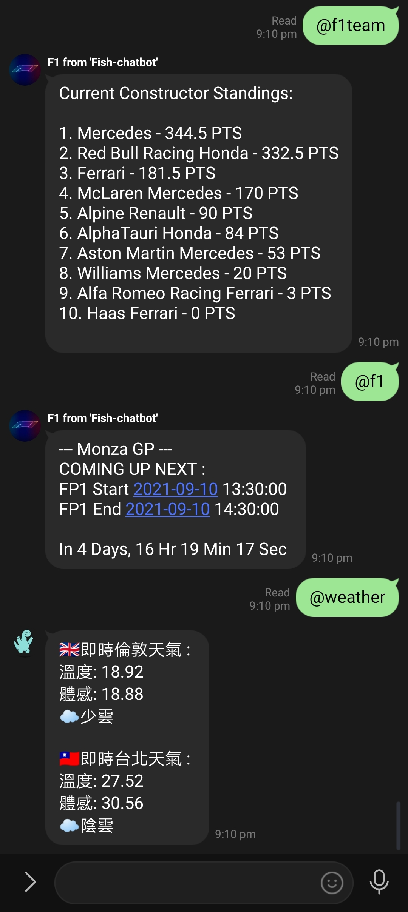

# line-bot
Line messenger bot

## Current usages
1. Auto Reply
    - Auto reply when certain text messeges/ command is received
2. Open Weather API
    - Grab weather data from different city
3. Web scrapper
    - Scrape https://www.f1.com to get f1 weekly race calender 
    - Scrpae website to get current driver/ constructor championship stnading
4. Count down
    - Count down function to certain date/ events

## Installation

```git clone https://github.com/FISHWONGY/line-bot/```

```pip install -r requirements.txt```

## Example Output

