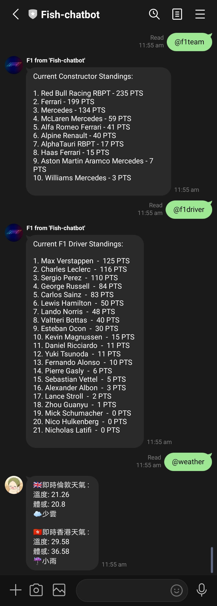

# line-bot
Line messenger bot

## Installation

```git clone https://github.com/FISHWONGY/line-bot/```

```pip install -r requirements.txt```

## Hosting
1. Create an account on [LINE Developer](https://developers.line.biz/en/)
2. Register an Messanging API
3. Use [ngrok](https://dashboard.ngrok.com/) for webhook
4. Run ```ngrok http 5000```
5. Change webhook URL in Messaging API

## Current usages
- Auto Reply
    - Auto reply when text messeges/ command is received
- Open Weather API
    - Grab weather data from different city
- Web scrapper
    - Scrape https://www.f1.com to get F1 weekly race calender 
    - Scrpae the F1 website to get current driver/ constructor championship stnading
    - Scrape table from wiki
- Count down
    - Count down function to certain date/ events
- Random Drawing
    - Automatically choose restaurant


## Example


